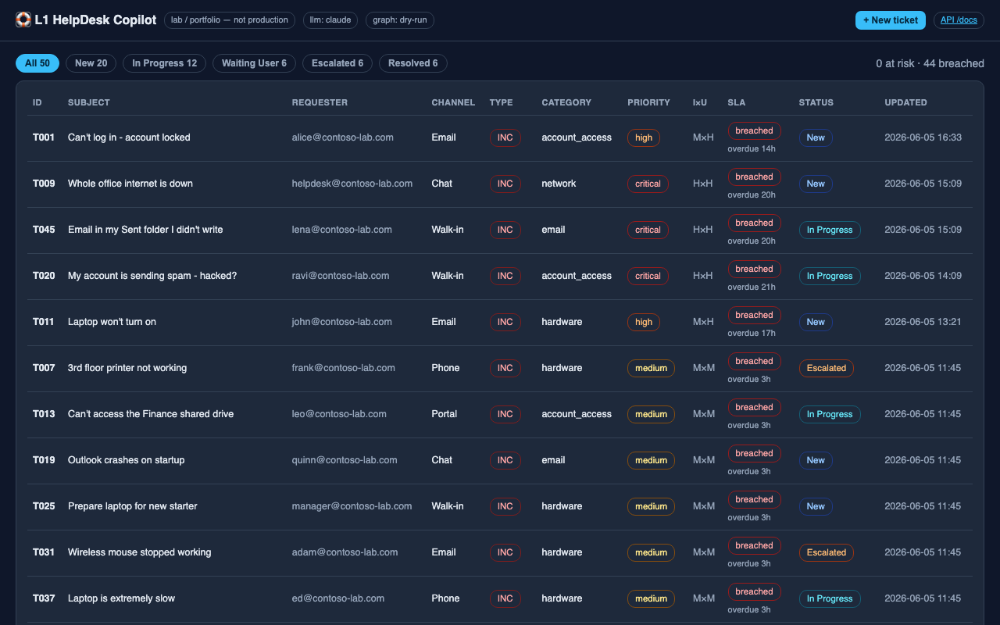

# L1 HelpDesk Copilot




> ⚠️ **Personal portfolio / lab only — not a production system.**
> All LLM calls go to the Anthropic API; all Microsoft Graph calls target a **free, isolated
> Microsoft Entra lab tenant**, default `GRAPH_DRY_RUN=true` (simulate, don't modify the tenant).
> Do not point this at any real or production credentials or data.

**▶ Live demo:** **https://l1-helpdesk-copilot.onrender.com** — public, **mock mode** (rule-baseline classifier + dry-run Microsoft Graph, no keys; first load may take ~30s to wake on the free tier). See [`docs/keep-warm.md`](docs/keep-warm.md) to ping `/healthz` every ~14 min and avoid cold starts. The real Claude accuracy numbers are in [Eval results](#eval-results) below.

An IT Support (L1 / Help Desk) portfolio project built around a real **Service Desk ticket
lifecycle**: a ticket queue (New → In Progress → Waiting User → Escalated → Resolved) with
ITSM fields (Incident vs Service Request, Impact × Urgency → Priority, computed SLA risk,
channel, requester), a per-ticket **timeline**, escalation reasons, and resolution codes — with
**Claude as the L1 copilot** on top: it triages each ticket, drafts a citation-grounded reply
from a KB, and (for account requests) executes Microsoft Graph actions in a lab tenant.

## What it does
1. **Ticket queue** — every ticket carries category · priority · **impact × urgency** · SLA risk ·
   incident-vs-request · requester · channel · status, filterable by lifecycle state.
2. **AI triage (Claude)** — classifies category, priority, **impact**, **urgency**, incident-vs-request,
   and which KB article is hit. Priority is also cross-checked against the ITIL **Impact × Urgency** matrix.
3. **RAG reply** — retrieve from a markdown KB and draft an L1 reply that cites the relevant articles.
4. **Lifecycle actions** — start / wait on user / **escalate to L2** (team + reason) / **resolve** (resolution code) —
   each recorded on the ticket's **timeline**.
5. **Execute (Microsoft Graph, lab tenant)** — create user / reset password / add to group / assign license,
   tied back to the originating ticket.
6. **Audit + timeline** — a per-ticket timeline (SQLite) plus a global audit log in the same DB (`audit_events`).
7. **Eval** — score the classifier on 60 labeled tickets to get an honest accuracy number.

## Service Desk workspace
The single-page UI (`/`) is a two-view workspace, not just an AI box:
- **Queue** — status chips with live counts, an SLA summary (*N at risk · M breached*), and a table colored
  by SLA risk (on-track / at-risk / breached / met / missed).
- **Ticket detail** — full ITSM facts (incl. both the classified priority **and** the Impact × Urgency
  derivation), an AI-copilot panel (triage + cited reply with human-in-the-loop feedback), lifecycle
  controls (escalate with reason + team, resolve with a resolution code), the suggested Graph action
  (behind the confidence guardrail), and a live **timeline** of everything that happened to the ticket.

Seeded from the 60 sample tickets on first run, so the queue is populated and the SLA colors are live
immediately — fully offline (rule baseline), no API key required.

## Tech stack
Python · FastAPI · **SQLite** (ticket store + timeline, stdlib) · Anthropic SDK (Claude)
· Microsoft Graph REST (`azure-identity` + `httpx`) · markdown KB + lightweight retrieval
· single-page vanilla-JS UI.

## Quick start
```bash
python3 -m venv .venv && source .venv/bin/activate
pip install -r requirements.txt
cp .env.example .env          # fill keys as needed; it also runs with the rule baseline and no keys
uvicorn app.main:app --reload
# UI:   http://127.0.0.1:8000/
# API:  http://127.0.0.1:8000/docs
```

### Run with Docker
```bash
docker build -t l1-helpdesk-copilot .
docker run --rm -p 8000:8000 -e PORT=8000 l1-helpdesk-copilot
# UI: http://127.0.0.1:8000/  (mock LLM + Graph dry-run by default)
```
Mount a volume or pass `-e` flags for `ANTHROPIC_API_KEY`, Azure creds, etc. if needed.
With no keys set, `USE_MOCK_LLM=true` uses a **local rule baseline** for classification — handy for an
offline demo, and the baseline the Claude classifier is measured against. Set `ANTHROPIC_API_KEY`
and `USE_MOCK_LLM=false` to use Claude.

## Eval results
On **60 hand-labeled tickets** (expanded from 50; `kb_hit` gold labels re-cleaned with a consistent
NONE-vs-article rule), rule baseline (keyword counts) vs. Claude (Haiku 4.5, strict structured
output, `temperature=0` for reproducibility):

| Field | Keyword baseline | Claude | Δ |
|---|---|---|---|
| category | 82% | **85%** | +3 |
| incident vs request | 82% | **98%** | +17 |
| priority | 57% | **78%** | +22 |
| kb_hit | 52% | **87%** | +35 |
| category macro-F1 | 71% | **85%** | +14 |

Reproduce: `python -m eval.run_eval --engine both --show-errors`

## Tests
```bash
pip install -r requirements-dev.txt
pytest -q
ruff check .
mypy
pre-commit run --all-files   # optional local hook pass
```
CI runs ruff + mypy + pytest on every push/PR to `main` (see [`.github/workflows/ci.yml`](.github/workflows/ci.yml)).

**Honest notes / limitations:**
- The test set is **60 tickets, single-annotator** — for a portfolio demo, not a rigorous benchmark; `temperature=0` makes it reproducible, but on a small set a few points shouldn't be over-read.
- **kb_hit** labels were re-cleaned (⭐3): assign a KB id only when an article's L1 steps directly apply; NONE for offboarding, HR/process, or LOB outages. Claude kb_hit rose from 72% (old 50-set) to **87%** on the expanded set — partly cleaner gold, partly six new articles (KB007–KB012).
- **priority** is inherently subjective; the prompt rubric + few-shot calibration helps but won't match every annotator.
- KB retrieval (BM25) is **independent** of the classifier's kb_hit field — even when the classifier is wrong, retrieval often still cites the right article.

## Microsoft Graph — live-verified
The four account actions ship with `GRAPH_DRY_RUN=true` by default (prints the exact Graph request,
with passwords redacted). Three were **verified live against a real free Entra tenant**:
`create_user → 201` · `reset_password → 204` · `add_to_group → 204`. The app's identity was granted
the **User Administrator** directory role (least privilege); `assign_license` stays dry-run because a
free tenant has no paid SKUs. Setup: [`docs/m365-setup.md`](docs/m365-setup.md).

## Roadmap
- [x] Phase 0 · Scaffold (config / models / runnable FastAPI + rule baseline)
- [x] Phase 1 · Claude structured classification + CSV ingest
- [x] Phase 2 · KB + RAG citation-grounded reply
- [x] Phase 3 · 60-ticket labeled test set + eval script (`python -m eval.run_eval`)
- [x] Phase 4 · Microsoft Graph account actions + audit log (live-verified, see above)
- [x] Phase 5 · Minimal single-page UI (`/`): triage + cited reply + suggested action + audit panel
- [x] Phase 6 · **Service Desk workspace** — SQLite ticket store + queue/detail UI, status lifecycle
  (New → In Progress → Waiting User → Escalated → Resolved), Impact × Urgency → Priority,
  computed **SLA risk**, escalation reason + L2 team, resolution codes, and a per-ticket **timeline**
- [x] Extras · **Confidence-threshold guardrail** (low-confidence triage blocks real actions until human review) + **reply feedback buttons** (resolved / escalate, written to the audit log)

## Layout
```
app/        FastAPI app: config / models / classifier / kb / responder / graph_actions / audit / main
            + store.py (SQLite tickets + timeline) + sla.py (SLA targets + Impact×Urgency matrix)
kb/         markdown knowledge-base articles
data/       sample tickets CSV (with gold labels) — also seeds the ticket queue on first run
eval/       eval script (writes eval/last_results.json, gitignored)
docs/       setup guide (m365-setup.md), keep-warm pinger notes
```
